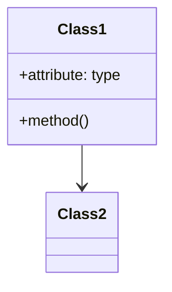

# [FEATURE NAME] - Product Requirements Document
*Status: Draft | Version: 1.0 | Last Updated: YYYY-MM-DD*

## 1. Overview
### Problem Statement
[Describe the problem this feature solves]

### Goals & Success Metrics
- **Primary Goal**: [Main objective]
- **Success Metrics**:
  - [Metric 1]
  - [Metric 2]

## 2. User Stories
### Primary User Story
As a [user role], I want [feature] so that [benefit].

### Additional User Stories
- [ ] As a [role], I want [feature] so that [benefit]
- [ ] As a [role], I want [feature] so that [benefit]

## 3. Requirements
### Functional Requirements
- [ ] FR-1: [Description]
- [ ] FR-2: [Description]

### Non-Functional Requirements
- [ ] NFR-1: [Performance, Security, etc.]
- [ ] NFR-2: [Scalability, etc.]

## 4. Technical Design
### Architecture
[High-level technical design]

### Data Model

## 5. Acceptance Criteria
- [ ] AC-1: [Testable criteria]
- [ ] AC-2: [Testable criteria]

## 6. Dependencies
- [ ] Dependency 1
- [ ] Dependency 2

## 7. Risks & Mitigations
| Risk | Impact | Likelihood | Mitigation |
|------|--------|------------|------------|
| [Risk] | [H/M/L] | [H/M/L] | [Plan] |

## 8. Open Questions
- [ ] Question 1
- [ ] Question 2
